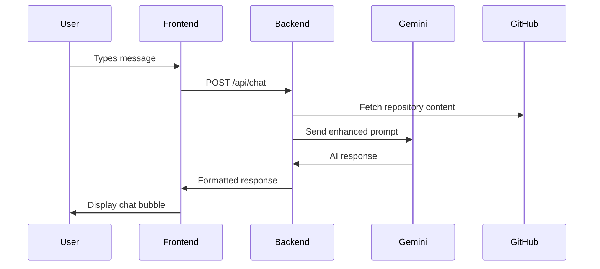
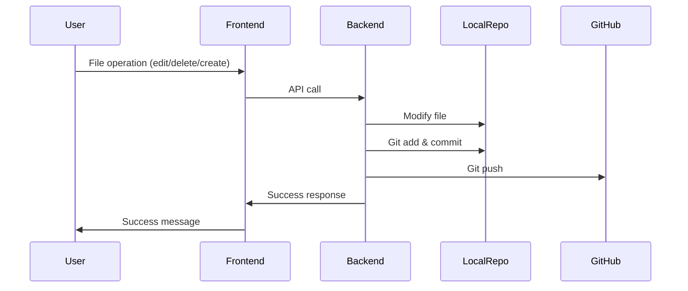

# AI Chatbot Project - Complete Documentation

## 🚀 Project Overview

This is a **full-stack AI-powered chatbot application** that integrates with **Google Gemini AI** to provide intelligent responses about your codebase. The application can analyze repository files, answer questions about code, and provide file management capabilities with Git integration.

## 📋 Table of Contents

1. [Architecture Overview](#architecture-overview)
2. [Technology Stack](#technology-stack)
3. [Backend Components](#backend-components)
4. [Frontend Components](#frontend-components)
5. [Key Features](#key-features)
6. [API Endpoints](#api-endpoints)
7. [File Structure](#file-structure)
8. [Configuration](#configuration)
9. [Installation & Setup](#installation--setup)
10. [How It Works](#how-it-works)

---

## 🏗️ Architecture Overview

```
┌─────────────────┐    HTTP/REST API    ┌─────────────────┐
│   React Frontend │ ←──────────────────→ │ Spring Boot     │
│   (Port 3000)    │                     │ Backend         │
│                 │                     │ (Port 8080)     │
└─────────────────┘                     └─────────────────┘
         │                                       │
         │                                       │
         ▼                                       ▼
┌─────────────────┐                     ┌─────────────────┐
│   UI Components │                     │  Google Gemini  │
│   • Chat Interface│                     │  AI API         │
│   • File Manager│                     │                 │
│   • Modals      │                     └─────────────────┘
└─────────────────┘                              │
                                                 ▼
                                        ┌─────────────────┐
                                        │ Local Git Repo  │
                                        │ & GitHub        │
                                        └─────────────────┘
```

---

## 🛠️ Technology Stack

### **Backend Technologies**

| Technology | Version | Purpose |
|------------|---------|---------|
| **Java** | 21 | Core programming language |
| **Spring Boot** | 3.5.3 | Web framework & dependency injection |
| **Spring Web** | - | REST API development |
| **Spring Retry** | 2.0.5 | Retry mechanism for API calls |
| **Spring AOP** | - | Aspect-oriented programming support |
| **Lombok** | 1.18.30 | Reduce boilerplate code |
| **Jackson** | - | JSON serialization/deserialization |
| **Maven** | - | Build tool & dependency management |
| **Google Gemini AI** | 2.0-flash | AI language model |
| **GitHub API** | v3 | Repository integration |

### **Frontend Technologies**

| Technology | Version | Purpose |
|------------|---------|---------|
| **React** | 19.1.0 | UI library |
| **Vite** | Latest | Build tool & dev server |
| **Axios** | 1.11.0 | HTTP client |
| **Framer Motion** | 12.23.6 | Animations & transitions |
| **Tailwind CSS** | 3.5.7 | Utility-first CSS framework |
| **Heroicons** | 2.2.0 | Icon library |
| **React Scroll to Bottom** | 4.2.0 | Auto-scroll functionality |
| **React Markdown** | 10.1.0 | Markdown rendering |
| **ESLint** | - | Code linting |
| **PostCSS** | - | CSS processing |

---

## 🔧 Backend Components

### **1. Main Application (`ChatbotApplication.java`)**
- **Purpose**: Entry point of the Spring Boot application
- **Features**:
  - Enables retry mechanisms (`@EnableRetry`)
  - Enables asynchronous processing (`@EnableAsync`)
  - Configures RestTemplate bean for HTTP calls

### **2. Controllers**

#### **ChatController (`/api/chat`)**
- **Purpose**: Handles chat conversations with AI
- **Key Method**: `POST /api/chat`
- **Features**:
  - Loads repository content as context
  - Sends enhanced prompts to Gemini AI
  - Supports intelligent code formatting
  - Returns formatted responses

#### **FileController (`/api/file`)**
- **Purpose**: Manages file operations
- **Endpoints**:
  - `GET /content` - Read file content
  - `POST /update` - Update file content
  - `DELETE /delete` - Delete files

#### **RepoController (`/api/repo`)**
- **Purpose**: Repository information management
- **Endpoints**:
  - `GET /info` - Get repository metadata
  - `POST /create-file` - Create new files

### **3. Services**

#### **GeminiService**
- **Purpose**: Integration with Google Gemini AI
- **Features**:
  - Retry mechanism with exponential backoff
  - Error handling for API failures
  - Request rate limiting
  - Secure API key management

#### **FileService**
- **Purpose**: File and Git operations
- **Key Methods**:
  - `loadRepoContent()` - Load all repository files
  - `createAndPushFileToGithub()` - Create and commit files
  - `updateAndPushFile()` - Update and commit changes
  - `deleteAndPushFile()` - Delete and commit removal
  - `fetchGithubFileContent()` - Fetch remote file content

### **4. Models**

#### **Data Transfer Objects (DTOs)**
- `ChatRequest` - Chat input from frontend
- `ChatResponse` - Chat response to frontend
- `RepoInfo` - Repository metadata
- `CreateFileRequest/Response` - File creation data

---

## 🎨 Frontend Components

### **1. Core Components**

#### **App.jsx (Main Component)**
- **Purpose**: Root component managing entire application state
- **Key Features**:
  - Chat interface management
  - File operations (view, edit, delete, create)
  - Modal management
  - Error handling
  - Sound effects integration

#### **RepoInfo.jsx**
- **Purpose**: Repository information display and file management
- **Features**:
  - Display repository metadata
  - File listing with actions
  - Dropdown actions menu
  - File operation modals

### **2. UI Components**

#### **AnimatedBackground.jsx**
- **Purpose**: Dynamic background animations
- **Features**: Particle effects and gradients

#### **ConnectionStatus.jsx**
- **Purpose**: Display backend connection status
- **Features**: Real-time connection monitoring

#### **TypewriterText.jsx**
- **Purpose**: Animated text typing effect
- **Features**: Configurable typing speed

#### **formatBotResponse.jsx**
- **Purpose**: Format AI responses for display
- **Features**:
  - Code syntax highlighting
  - Markdown parsing
  - Text formatting utilities

### **3. Chat Components**

#### **ChatBubble Component**
- **Purpose**: Individual message display
- **Features**:
  - User/bot message differentiation
  - Professional styling
  - Animation effects
  - Status indicators (sending, sent, error)

#### **TypingIndicator Component**
- **Purpose**: Show when AI is processing
- **Features**:
  - Animated typing dots
  - Professional appearance

---

## ✨ Key Features

### **🤖 AI Chat Interface**
- **Real-time chat** with Google Gemini AI
- **Context-aware responses** using repository content
- **Professional message styling** with animations
- **Sound effects** for message interactions
- **Typing indicators** and status updates

### **📁 File Management System**
- **View files** - Read-only file content display
- **Edit files** - In-browser file editing with syntax highlighting
- **Delete files** - Safe file deletion with confirmation
- **Create files** - New file creation with content
- **Git integration** - Automatic commit and push operations

### **🔄 Git Integration**
- **Automatic commits** for all file operations
- **Push to remote** repository (GitHub)
- **File synchronization** between local and remote
- **Repository metadata** display

### **🎨 Modern UI/UX**
- **Responsive design** works on all devices
- **Dark theme** with professional styling
- **Smooth animations** using Framer Motion
- **Interactive elements** with hover effects
- **Modal dialogs** for file operations

### **⚡ Performance Features**
- **Auto-scroll** to latest messages
- **Optimized re-renders** with React hooks
- **Lazy loading** for large file lists
- **Error recovery** with retry mechanisms

---

## 🔗 API Endpoints

### **Chat Endpoints**
```http
POST /api/chat
Content-Type: application/json

{
  "question": "string",
  "source": "remote|local"
}
```

### **File Management Endpoints**
```http
# Get file content
GET /api/file/content?filePath={filePath}

# Update file
POST /api/file/update
{
  "filePath": "string",
  "content": "string"
}

# Delete file
DELETE /api/file/delete?filePath={filePath}
```

### **Repository Endpoints**
```http
# Get repository info
GET /api/repo/info

# Create new file
POST /api/repo/create-file
{
  "fileName": "string",
  "content": "string"
}
```

---

## 📂 File Structure

```
ai-chatbot/
├── backend/
│   ├── src/main/java/com/example/chatbot/
│   │   ├── ChatbotApplication.java          # Main application
│   │   ├── controller/
│   │   │   ├── ChatController.java          # Chat API
│   │   │   ├── FileController.java          # File operations
│   │   │   └── RepoController.java          # Repository API
│   │   ├── service/
│   │   │   ├── GeminiService.java           # AI integration
│   │   │   └── FileService.java             # File/Git operations
│   │   └── model/
│   │       ├── ChatRequest.java             # DTOs
│   │       ├── ChatResponse.java
│   │       └── RepoInfo.java
│   ├── src/main/resources/
│   │   └── application.properties           # Configuration
│   └── pom.xml                              # Maven dependencies
│
├── frontend/
│   ├── src/
│   │   ├── App.jsx                          # Main React component
│   │   ├── components/
│   │   │   ├── RepoInfo.jsx                 # Repository info
│   │   │   ├── AnimatedBackground.jsx       # UI effects
│   │   │   ├── ConnectionStatus.jsx         # Status indicator
│   │   │   ├── TypewriterText.jsx           # Text animations
│   │   │   └── formatBotResponse.jsx        # Response formatting
│   │   ├── utils/
│   │   │   └── sounds.js                    # Sound management
│   │   └── assets/                          # Images and icons
│   ├── package.json                         # NPM dependencies
│   ├── vite.config.js                       # Vite configuration
│   └── tailwind.config.js                   # Tailwind CSS config
│
└── repo-clone/                              # Local repository clone
    └── [repository files]
```

---

## ⚙️ Configuration

### **Backend Configuration (`application.properties`)**
```properties
# Server Configuration
server.port=8080

# Repository Settings
repo.local.path=/path/to/local/repo
repo.github.owner=your-username
repo.github.name=repository-name
repo.github.branch=main
repo.github.token=your-github-token

# AI Configuration
gemini.api.key=your-gemini-api-key
```

### **Frontend Configuration**
- **Vite** for development server and building
- **Tailwind CSS** for styling
- **ESLint** for code quality
- **PostCSS** for CSS processing

---

## 🚀 Installation & Setup

### **Prerequisites**
- Java 21+
- Node.js 18+
- Maven 3.6+
- Git
- GitHub account
- Google Cloud account (for Gemini AI)

### **Backend Setup**
```bash
# 1. Clone the repository
git clone <repository-url>
cd ai-chatbot

# 2. Configure application.properties
# Add your GitHub token and Gemini API key

# 3. Run the backend
./mvnw spring-boot:run
```

### **Frontend Setup**
```bash
# 1. Navigate to frontend directory
cd frontend

# 2. Install dependencies
npm install

# 3. Start development server
npm run dev
```

### **Full Application Startup**
```bash
# Run both backend and frontend simultaneously
./start-app.sh
```

---

## 🔄 How It Works

### **1. Application Startup**
1. **Backend**: Spring Boot starts on port 8080
2. **Frontend**: Vite dev server starts on port 3000
3. **Configuration**: Loads API keys and repository settings
4. **Repository**: Connects to local and remote Git repositories

### **2. Chat Flow**


### **3. File Operations Flow**


### **4. Key Workflows**

#### **Chat Interaction**
1. User types message in chat input
2. Frontend sends request to `/api/chat`
3. Backend loads repository content as context
4. Enhanced prompt sent to Gemini AI
5. AI response formatted and returned
6. Frontend displays response with animations

#### **File Management**
1. User clicks file action (View/Edit/Delete)
2. Modal opens with appropriate interface
3. User performs action
4. Backend processes file operation
5. Git operations (add, commit, push) executed
6. Success/error feedback displayed

#### **Repository Synchronization**
1. Backend fetches repository metadata
2. Local files listed and synchronized
3. GitHub API used for remote operations
4. File changes automatically committed
5. Repository state updated in real-time

---

## 🎯 Benefits & Use Cases

### **For Developers**
- **Code Analysis**: Ask questions about your codebase
- **Documentation**: Generate explanations for complex code
- **File Management**: Quick file operations with Git integration
- **Learning**: Understand unfamiliar code patterns

### **For Teams**
- **Code Reviews**: AI-assisted code understanding
- **Onboarding**: Help new team members understand codebase
- **Knowledge Sharing**: Interactive documentation
- **Productivity**: Faster code navigation and understanding

---

## 🏆 Project Achievements

This comprehensive AI Chatbot project successfully demonstrates:

1. **Full-Stack Development** - Complete integration between React frontend and Spring Boot backend
2. **AI Integration** - Seamless Google Gemini AI integration for intelligent responses
3. **Git Automation** - Automatic version control operations with GitHub integration
4. **Modern UI/UX** - Professional, responsive design with smooth animations
5. **Real-time Features** - Live chat interface with typing indicators and status updates
6. **File Management** - Complete CRUD operations with Git synchronization
7. **Error Handling** - Robust error recovery and user feedback mechanisms
8. **Performance Optimization** - Efficient rendering and API call management

This project showcases modern software development practices and creates a powerful tool for code analysis and repository management through an intuitive chat interface powered by artificial intelligence.